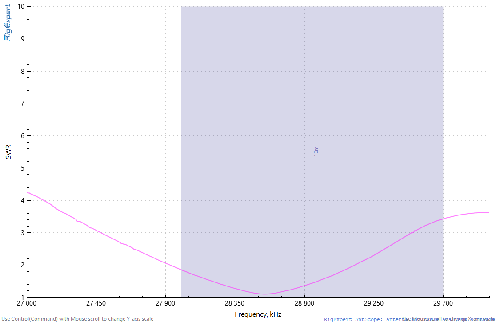
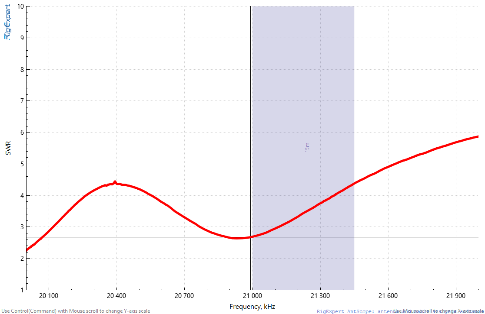

# Antenna testing
By KE8TJE

- A new 40m EFHW was installed 22/11/2024 on a roof work organized by N3AMK and others.
- I wanted to test and record the performance before using them. The test setup is as follows
	- A Nano VNA calibrated prior to using
	- Antennas were connected with a `DLW filter Model L1718` before connecting to the VNA
	- Data was saved with the desktop app
---
## Yagi testing - 20 m

---
## Yagi on 10 m

---
# EFHW testing

## 10 m

---

## 20 m

---
## 40 m

---

## Test Tuning the EFHW

- Current configuration: SWE 1.69 @ 14.540 M
- Added 5 turns to the coax to act as a choke
- Added a small length: 
	- SWR 1.89 @14.120 M
	- SWr 10 M not great. out of band at ~26 M it goes to 1.0
---

---
## Post addition - 20 m

---

## Remove added section

- electrically isolated the section

---

---

---
## YAGI 20M Testing - KA3WVU (25/11/2024)

---
## Yagi 10 m - testing 

---
# Yagi 15 m

---
## 26/01/2025 - WFD testing

- AD8LQ and KE8TJE was operating for field day
- Initial test with rotating showed high SWR
- With rotator at 080 re testing at 1102 h (EST)
  
	

---
- Rotated it to 000: Min SWR 1.02
  
---

