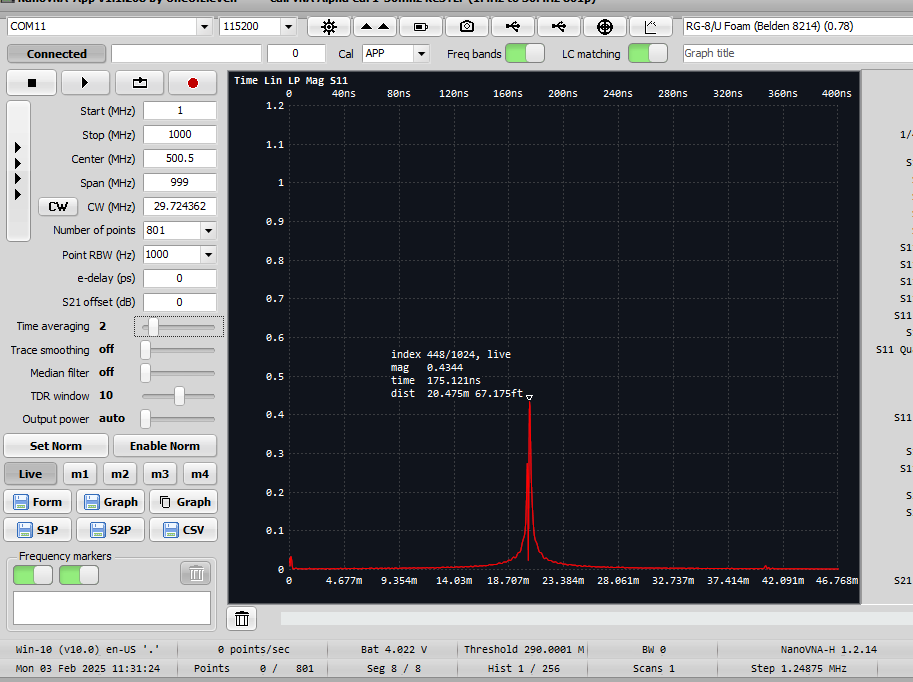

## Roofday - 03.02.2025

### Observations
- 10m is fine
- To fold down the antenna it needs to be in a $240 \degree$ to make it foldable

#### Measurements from the base - with $50$

New Coax Measurements N to PL RG-8U

